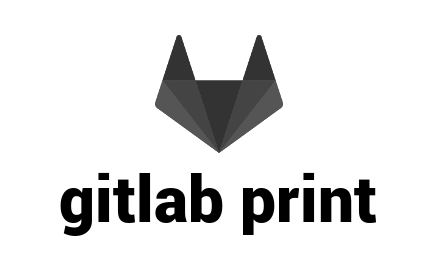
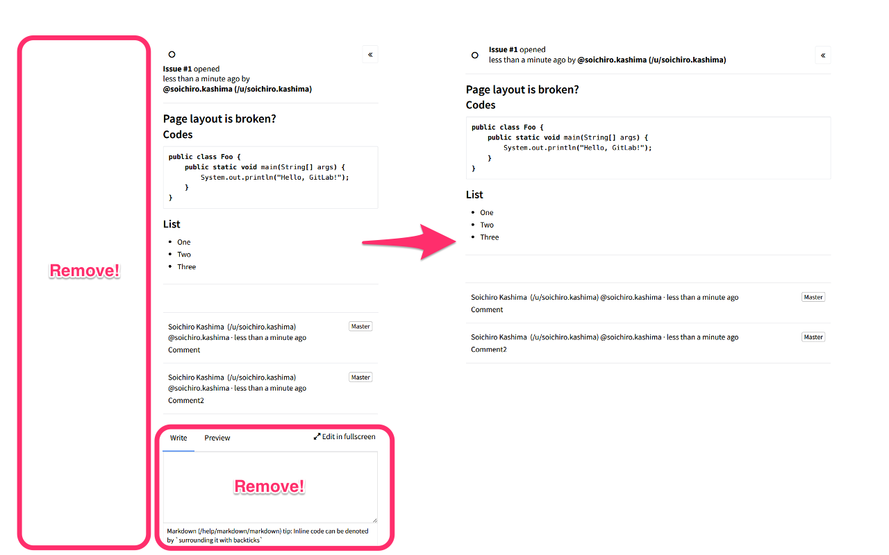

# 

> Chrome extension to adjust layout of GitLab pages for printing.

[][store]

Adjust layout of GitLab pages for printing.  
There are redundant components and space
when we print GitLab pages (markdown page, issues, merge requests, etc.).  
With this extension, you can remove them from the contents.

## Usage

1. Install extension from the [chrome web store][store].
1. Show pages on your GitLab site.
1. Click the extension button: 
1. Print the page.
1. If you want to see the original content,  
   click the extension button again
   or click the revert link on top of the page, or reload the page.

## Tests

This extension is tested on following GitLab versions:

* v8.6.1
* v7.14.0

## License

MIT &copy; Soichiro Kashima

[store]: https://chrome.google.com/webstore/detail/gitlab-print/ooopojgjhkkklgmdahnahcneikejmllm
